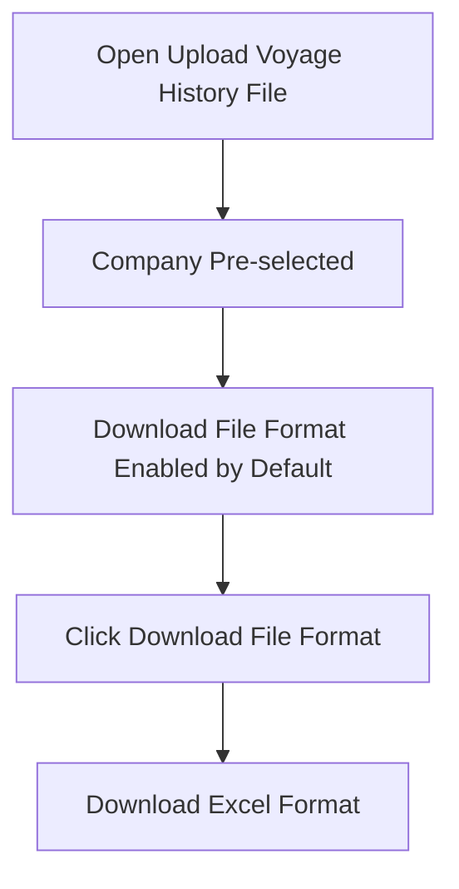
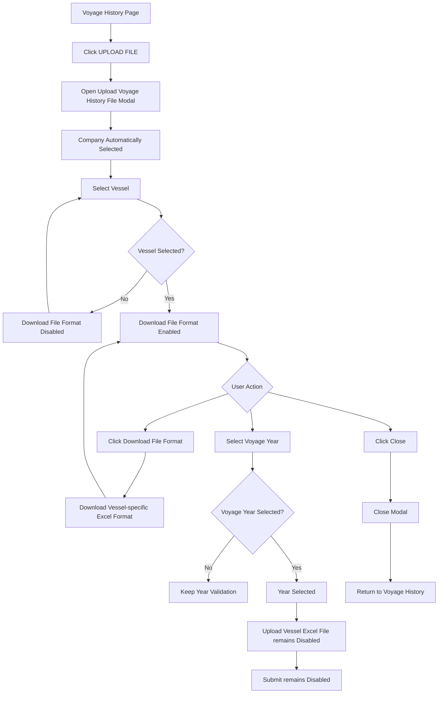
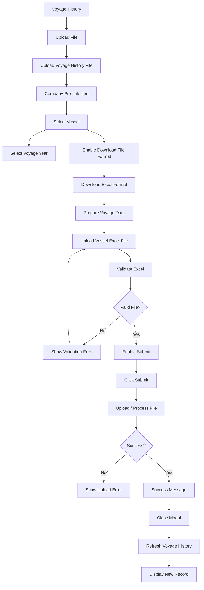

# Voyage History — Complete IA, User Flow & Functional Specification

## 1. Overview

The **Voyage History** module allows Client Admin users to view previously uploaded voyage-history records and initiate the voyage-history upload process.

The module consists of two primary experiences:

1. **Voyage History Listing**
2. **Upload Voyage History File**

The implementation must integrate into the **existing Client Portal** and reuse the existing sidebar, header, typography, colors, components, spacing, and interaction patterns.

The provided reference screenshots are the primary visual reference.

---

# 2. Product Goal

The goal of Voyage History is to provide a simple and controlled workflow for managing vessel voyage-history Excel files.

The user should be able to:

* View existing voyage-history uploads.
* Search records.
* Filter records by year.
* Download existing voyage-history files.
* Start a new voyage-history upload.
* Select the vessel.
* Select the voyage year.
* Download the correct Excel file format/template for the selected vessel.
* Prepare the file for upload.
* Upload the completed file in the future.

### Current implementation scope

The **Upload Vessel Excel File** control should remain disabled for now.

The upload functionality can be added later without changing the overall information architecture.

---

# 3. Information Architecture

```text
Client Portal
│
├── Dashboard
│
├── Upload Documents
│
├── Document List
│
├── Voyage History
│   │
│   ├── Page Header
│   │   ├── Voyage History
│   │   ├── Description
│   │   └── Upload File
│   │
│   ├── Search & Filter
│   │   ├── Search
│   │   ├── Search Button
│   │   ├── Year
│   │   └── Clear Filter
│   │
│   └── Voyage History Table
│       ├── SLNO
│       ├── Vessel
│       ├── Uploaded File
│       ├── Uploaded On
│       └── Action
│           └── Download
│
└── Upload Voyage History File
    │
    ├── Company Name
    │   └── Default Selected / Read Only
    │
    ├── Vessel
    │   └── Required
    │
    ├── Voyage Year
    │   └── Required
    │
    ├── Download File Format
    │   └── Enabled by default
    │
    ├── Upload Vessel Excel File
    │   └── Disabled by default — Enabled after Vessel and Voyage Year selection
    │
    └── Modal Actions
        ├── Close
        └── Submit
```

---

# 4. Voyage History Page

## 4.1 Page Header

### Title

```text
Voyage History
```

### Description

```text
Manage and upload vessel voyage records for selected years. Use the sample format for consistency.
```

### Primary Action

```text
UPLOAD FILE
```

Clicking **UPLOAD FILE** opens the Upload Voyage History File modal.

---

# 5. Voyage History Search & Filter

The page contains:

```text
[ Search                         ] [ Search ] [ Year             ] [ Clear ]
```

## Search

Search should support:

* Vessel name
* Uploaded filename

Example:

```text
Search: STI CAMDEN
```

Results should display matching voyage-history records.

Search should be:

* Case-insensitive.
* Trimmed for leading/trailing spaces.
* Applied when the user clicks Search.

---

## Year Filter

The Year field filters records by year.

Example:

```text
Year
2026
```

Search and Year should work together using **AND logic**.

```text
Search = STI CAMDEN
Year = 2026

        ↓

STI CAMDEN AND 2026
```

---

## Clear Filter

The clear control resets:

* Search
* Year

After clearing, the complete voyage-history dataset is displayed.

---

# 6. Voyage History Table

The table contains exactly five columns.

| Column        | Purpose                           |
| ------------- | --------------------------------- |
| SLNO          | Sequential record number          |
| Vessel        | Vessel associated with the record |
| Uploaded File | Uploaded Excel filename           |
| Uploaded On   | File upload date                  |
| Action        | Download action                   |

Column order must remain:

```text
SLNO
Vessel
Uploaded File
Uploaded On
Action
```

---

# 7. Initial Reference Data

Use the exact data from the provided reference.

| SLNO | Vessel             | Uploaded File                                            | Uploaded On |
| ---: | ------------------ | -------------------------------------------------------- | ----------- |
|    1 | LAVENDER1          | voyage_history_sample (8).xlsx                           | 17-Jul-2026 |
|    2 | AMI VESSEL -1      | voyage_history_sample (4).xlsx                           | 03-Jul-2026 |
|    3 | STI CAMDEN         | STI CAMDEN_voyage_history_sample_2024 - Copy - Copy.xlsx | 03-Jul-2026 |
|    4 | STI CAMDEN         | STI CAMDEN_voyage_history_sample_2025.xlsx               | 03-Jul-2026 |
|    5 | STI CAMDEN         | STI CAMDEN_voyage_history_sample_2026 - Copy.xlsx        | 03-Jul-2026 |
|    6 | DEEPWATER THALASSA | 2024_DEEPWATER THALASSA_voyage_history_sample (17).xlsx  | 02-Jul-2026 |

Do not rename or modify these filenames.

---

# 8. Voyage History Table Behaviour

The table should:

* Display the reference records.
* Support vertical scrolling.
* Maintain consistent column alignment.
* Keep the Action column aligned vertically.
* Prevent long filenames from breaking the layout.
* Use the existing application table styling where available.

The table should visually match the reference screenshot.

---

# 9. Download Existing Voyage File

Each record has a download icon.

```text
Voyage Record
      ↓
Click Download
      ↓
Identify selected file
      ↓
Download corresponding file
```

The download action must only download the file belonging to the selected row.

The icon must have an accessible label such as:

```text
Download voyage history file
```

---

# 10. Upload Voyage History Entry Flow

From the Voyage History page:

```text
Voyage History
      ↓
Click UPLOAD FILE
      ↓
Upload Voyage History File Modal
```

The page behind the modal should be dimmed using the application's existing modal overlay.

---

# 11. Upload Voyage History File — IA

```text
Upload Voyage History File
│
├── Header
│   └── Upload Voyage History File
│
├── Instructions
│   ├── Download or upload Excel files containing voyage data
│   └── Ensure you select the correct year before uploading.
│
├── Voyage Configuration
│   │
│   ├── Company Name
│   │   └── Default selected / Cannot change
│   │
│   ├── Vessel
│   │   └── Required selection
│   │
│   └── Voyage Year
│       └── Required selection
│
├── File Actions
│   │
│   ├── Download File Format
│   │   └── Enabled after Vessel selection
│   │
│   └── Upload Vessel Excel File
│       └── Disabled for current implementation
│
└── Footer Actions
    ├── CLOSE — Secondary
    └── SUBMIT — Primary
```

---

# 12. Upload Modal Layout

```text
┌─────────────────────────────────────────────────────┐
│ Upload Voyage History File                          │
│─────────────────────────────────────────────────────│
│                                                     │
│ • Download or upload Excel files containing        │
│   voyage data                                      │
│ • Ensure you select the correct year before        │
│   uploading.                                       │
│                                                     │
│ ┌─────────────────────────────────────────────────┐ │
│ │ Company Name                                    │ │
│ │ DENALI                                    ▼    │ │
│ │                                                 │ │
│ │ Vessel                    Voyage Year *         │ │
│ │ ABCD ▼                    [ Year ]       📅     │ │
│ │                                                 │ │
│ │ ┌─────────────────┐   ┌──────────────────────┐ │ │
│ │ │ ↓               │   │ ↑                    │ │ │
│ │ │ Download File   │   │ Upload Vessel        │ │ │
│ │ │ Format          │   │ Excel File           │ │ │
│ │ └─────────────────┘   └──────────────────────┘ │ │
│ └─────────────────────────────────────────────────┘ │
│                                                     │
│                         [ CLOSE ] [ SUBMIT ]        │
└─────────────────────────────────────────────────────┘
```

---

# 13. Company Name

## Behaviour

The Company Name field is **automatically selected by default**.

Example:

```text
Company Name
DENALI
```

### Rules

* Company is populated from the logged-in user's/client context.
* User cannot change the company.
* The field is read-only.
* It should visually communicate that it is not editable.
* Do not display an active dropdown interaction if there is only one possible company.

### State

```text
Company = DENALI
Editable = No
Required = Yes
Default = Yes
```

---

# 14. Vessel Selection

Vessel is a required field.

Initial state:

```text
Vessel
Select Vessel ▼
```

After selection:

```text
Vessel
ABCD ▼
```

### Behaviour

Clicking Vessel opens the vessel selection list.

Example:

```text
Vessel
│
├── ABCD
├── LAVENDER1
├── AMI VESSEL -1
├── STI CAMDEN
└── DEEPWATER THALASSA
```

The actual vessel list should come from the application's available vessel data.

### Rules

* Vessel must be selected before continuing.
* Vessel selection controls the availability of **Download File Format**.
* Selecting a vessel enables the Download File Format action.

---

# 15. Voyage Year

Voyage Year is a required field.

Initial state:

```text
Voyage Year *
```

After selection:

```text
Voyage Year *
2026
```

### Rules

* User must select a year.
* The field should use the existing date/year picker component.
* The year should represent the voyage data the user intends to upload.
* The selected year should be available to the future upload-validation process.

---

# 16. Field Dependency

The key dependency in this flow is:

```text
Company
   ↓
Vessel
   ↓
Download File Format
```

Company is already selected.

Therefore the primary user interaction becomes:

```text
Company = DENALI
        ↓
Select Vessel
        ↓
Download File Format becomes enabled
```

Voyage Year is independently required for the upload process.

---

# 17. Download File Format

## Initial state

Before a vessel is selected:

```text
┌────────────────────────┐
│ ↓                      │
│ Download File Format   │
└────────────────────────┘
```

**Enabled by default.**

The user can download the standard file format at any time, or a vessel-specific format once a vessel is selected.

---

## After Vessel Selection

```text
Vessel = ABCD
        ↓
Download File Format
        ↓
Enabled (Vessel template)
```

---

# 18. Download File Format Flow



---

# 19. Upload Vessel Excel File

## Current State

The **Upload Vessel Excel File** control is **disabled by default**.

It becomes **enabled** once both **Vessel** and **Voyage Year** are selected:

```text
Upload Vessel
Excel File
(Enabled when Vessel & Voyage Year are selected)
```

---

# 20. Future Upload File Behaviour

The architecture should still allow this control to be enabled in a future implementation.

Future intended flow:

```text
Select Vessel
      ↓
Select Voyage Year
      ↓
Download File Format
      ↓
Prepare Excel File
      ↓
Upload Vessel Excel File
      ↓
Validate Excel
      ↓
Submit
```

For the current implementation, stop before the upload interaction.

---

# 21. Current Modal State

The initial modal should look approximately like:

```text
Company Name
DENALI
        ✓

Vessel
Not Selected
        ⚠

Voyage Year
Not Selected
        ⚠

Download File Format
Disabled

Upload Vessel Excel File
Disabled

CLOSE
Enabled

SUBMIT
Disabled
```

---

# 22. Submit Button

**SUBMIT** is the **Primary Action**.

However, under the current implementation scope, the upload control is disabled.

Therefore:

```text
SUBMIT
Disabled
```

The primary action should become active only when the upload flow becomes valid.

### Future enablement condition

```text
Company selected
AND
Vessel selected
AND
Voyage Year selected
AND
Excel file selected
AND
Excel file valid
        ↓
SUBMIT ENABLED
```

For now:

```text
Excel file = unavailable
        ↓
SUBMIT remains disabled
```

This prevents a user from submitting an incomplete upload.

---

# 23. Close Button

**CLOSE** is the **Secondary Action**.

It is always available unless the application is processing a non-cancellable operation.

```text
[ CLOSE ] [ SUBMIT ]
 Secondary   Primary
```

Clicking Close:

```text
Close
  ↓
Dismiss modal
  ↓
Return to Voyage History
```

No data should be submitted.

---

# 24. Primary / Secondary Action Hierarchy

The modal footer should follow this hierarchy:

```text
                         Secondary     Primary
                         ┌───────┐    ┌────────┐
                         │ CLOSE │    │ SUBMIT │
                         └───────┘    └────────┘
```

### Primary

```text
SUBMIT
```

Purpose:

* Complete the upload process.
* Visually stronger.
* Disabled until the complete upload workflow is valid.

### Secondary

```text
CLOSE
```

Purpose:

* Exit the modal.
* Less visually prominent.
* Remains available.

Do not add additional footer actions.

---

# 25. Complete Current User Flow



---

# 26. Complete Future Flow

The following describes the intended architecture when file upload is implemented later.



---

# 27. State Flow

```text
OPEN MODAL
    ↓
COMPANY PRE-SELECTED
    ↓
VESSEL NOT SELECTED
    │
    ├── Download Format = DISABLED
    ├── Upload Excel = DISABLED
    └── Submit = DISABLED
    ↓
SELECT VESSEL
    ↓
DOWNLOAD FORMAT = ENABLED
    │
    ├── Download Format
    │
    └── Select Voyage Year
            ↓
       Voyage Year Selected
            ↓
       Upload Excel = STILL DISABLED
            ↓
       Submit = STILL DISABLED
```

---

# 28. Interaction State Matrix

| Component       | Initial  | After Vessel | After Year | Current Scope   |
| --------------- | -------- | ------------ | ---------- | --------------- |
| Company         | Selected | Selected     | Selected   | Read-only       |
| Vessel          | Empty    | Selected     | Selected   | Active          |
| Voyage Year     | Empty    | Empty        | Selected   | Active          |
| Download Format | Disabled | **Enabled**  | Enabled    | Functional      |
| Upload Excel    | Disabled | Disabled     | Disabled   | Not implemented |
| Close           | Enabled  | Enabled      | Enabled    | Functional      |
| Submit          | Disabled | Disabled     | Disabled   | Not implemented |

---

# 29. Component Architecture

Use existing application components wherever possible.

```text
VoyageHistoryPage
│
├── PageHeader
│   ├── Title
│   ├── Description
│   └── UploadFileButton
│
├── VoyageHistoryFilters
│   ├── SearchInput
│   ├── SearchButton
│   ├── YearFilter
│   └── ClearFilter
│
├── VoyageHistoryTable
│   ├── TableHeader
│   ├── TableRows
│   └── DownloadAction
│
└── UploadVoyageHistoryModal
    │
    ├── ModalHeader
    │
    ├── Instructions
    │
    ├── CompanyNameField
    │   └── ReadOnly
    │
    ├── VesselSelect
    │
    ├── VoyageYearPicker
    │
    ├── FileActions
    │   ├── DownloadFileFormat
    │   └── UploadVesselExcelFile
    │
    └── ModalFooter
        ├── CloseButton
        └── SubmitButton
```

---

# 30. Data Model

A Voyage History record:

```text
VoyageHistoryRecord
│
├── id
├── vesselId
├── vesselName
├── fileName
├── uploadedOn
└── voyageYear
```

Upload configuration:

```text
VoyageHistoryUpload
│
├── companyId
├── companyName
├── vesselId
├── vesselName
├── voyageYear
└── file
```

Example:

```text
{
  companyId: "DENALI",
  companyName: "DENALI",
  vesselId: "ABCD",
  vesselName: "ABCD",
  voyageYear: 2026,
  file: null
}
```

For the current implementation, `file` remains unavailable because the Upload Vessel Excel File control is disabled.

---

# 31. Validation Rules

## Company

```text
Required: Yes
Editable: No
Default: Automatically selected
```

## Vessel

```text
Required: Yes
Editable: Yes
Default: None
```

## Voyage Year

```text
Required: Yes
Editable: Yes
Default: None
```

## Download File Format

```text
Enabled: Vessel selected
Disabled: Vessel not selected
```

## Upload Vessel Excel File

```text
Enabled: No
Current implementation: Disabled
```

## Submit

```text
Current implementation: Disabled
Future:
Company + Vessel + Year + Valid File = Required
```

---

# 32. Error & Empty States

### Vessel not selected

Download remains disabled.

No error needs to be shown until the user attempts an action requiring the vessel.

### Voyage Year not selected

Show required validation when appropriate:

```text
Voyage Year is required.
```

### No vessels available

```text
No vessels available.
```

### Download failure

```text
Unable to download the file format.
Please try again.
```

Future upload errors:

```text
Invalid Excel file.
```

```text
Unable to upload voyage history.
Please try again.
```

---

# 33. Accessibility

The implementation should follow WCAG AA.

### Modal

* Use proper dialog semantics.
* Trap keyboard focus inside the modal.
* Return focus to the Upload File button after closing.
* Support Escape to close.
* Prevent background interaction while open.

### Fields

All fields require accessible labels.

Required fields must be programmatically marked as required.

### Disabled Controls

Disabled controls should communicate their disabled state programmatically as well as visually.

### Icon buttons

Use accessible labels:

```text
Download File Format
```

```text
Upload Vessel Excel File
```

---

# 34. Visual Design Rules

The provided screenshots are the visual source of truth.

Maintain:

* Cream/off-white modal background.
* Dark typography.
* Existing Client Portal colors.
* Dark green primary action styling.
* Thin dark borders.
* Existing corner radius.
* Existing input heights.
* Existing spacing.
* Existing dropdown indicators.
* Existing calendar icon.
* Existing download/upload icons.
* Existing button styles.

Do not introduce:

* New colors.
* Gradients.
* Glass effects.
* New typography.
* Decorative illustrations.
* Unnecessary shadows.
* Additional actions.

---

# 35. Important UX Rules

### Rule 1 — Company is controlled by the system

The user should not be able to accidentally upload voyage history against another company.

```text
Company = System-selected
User = Cannot change
```

### Rule 2 — Vessel controls template availability

The user must select a vessel before downloading the file format.

```text
No Vessel → Download Disabled

Vessel Selected → Download Enabled
```

### Rule 3 — Voyage Year is mandatory

The user must select the voyage year before the upload process can eventually be submitted.

### Rule 4 — Upload remains disabled

The Upload Vessel Excel File control is intentionally disabled in the current release.

### Rule 5 — Submit remains disabled

Since the file-upload functionality is not currently available, Submit remains disabled.

### Rule 6 — Do not fake upload functionality

Do not open a file picker or simulate an upload when the Upload Vessel Excel File control is disabled.

---

# 36. End-to-End Architecture

```text
CLIENT PORTAL
│
└── VOYAGE HISTORY
    │
    ├── VIEW HISTORY
    │   ├── Search
    │   ├── Filter by Year
    │   ├── Clear Filters
    │   └── Download Existing File
    │
    └── UPLOAD FILE
        │
        └── UPLOAD VOYAGE HISTORY FILE
            │
            ├── COMPANY
            │   └── Default / Read Only
            │
            ├── VESSEL
            │   └── Required
            │
            ├── VOYAGE YEAR
            │   └── Required
            │
            ├── DOWNLOAD FILE FORMAT
            │   ├── Disabled before Vessel
            │   └── Enabled after Vessel
            │
            ├── UPLOAD VESSEL EXCEL FILE
            │   └── Disabled / Future
            │
            └── ACTIONS
                ├── CLOSE — Secondary
                └── SUBMIT — Primary / Disabled
```

---

# 37. Acceptance Criteria

## Voyage History Page

* [ ] Existing sidebar remains unchanged.
* [ ] Existing header remains unchanged.
* [ ] Voyage History page matches the reference.
* [ ] Search works.
* [ ] Year filter works.
* [ ] Clear filter works.
* [ ] Table uses exact reference data.
* [ ] Download actions are available.
* [ ] Table supports scrolling.

## Upload Modal

* [ ] Clicking Upload File opens the modal.
* [ ] Modal title is "Upload Voyage History File".
* [ ] Company is automatically selected.
* [ ] Company cannot be changed.
* [ ] Vessel starts unselected.
* [ ] Vessel can be selected.
* [ ] Voyage Year starts unselected.
* [ ] Voyage Year can be selected.
* [ ] Download File Format starts disabled.
* [ ] Selecting a vessel enables Download File Format.
* [ ] Download File Format works after vessel selection.
* [ ] Upload Vessel Excel File remains disabled.
* [ ] Upload Vessel Excel File does not open a file picker.
* [ ] Submit remains disabled in the current implementation.
* [ ] Close remains enabled.
* [ ] Close closes the modal.
* [ ] Close is the secondary action.
* [ ] Submit is the primary action.
* [ ] No unrelated UI is introduced.

---

# 38. Final UX Flow

```text
Voyage History
       │
       │ Click Upload File
       ▼
Upload Voyage History File
       │
       ├── Company
       │     └── DENALI
       │          ↓
       │       Read Only
       │
       ├── Vessel
       │     └── Select Vessel
       │             ↓
       │       Download Format Enabled
       │
       ├── Voyage Year
       │     └── Select Year
       │
       ├── Download File Format
       │     └── Available after Vessel selection
       │
       ├── Upload Vessel Excel File
       │     └── Disabled for now
       │
       └── Actions
             ├── CLOSE → Secondary
             └── SUBMIT → Primary / Disabled
```

## Core Principle

**Company is fixed → Vessel determines the available file format → Voyage Year defines the intended voyage period → Excel upload will be enabled in a future phase → Submit completes the upload only when the complete flow is available.**

This specification should be treated as the **functional and UX source of truth** while implementing the Voyage History page and its Upload Voyage History File modal.
